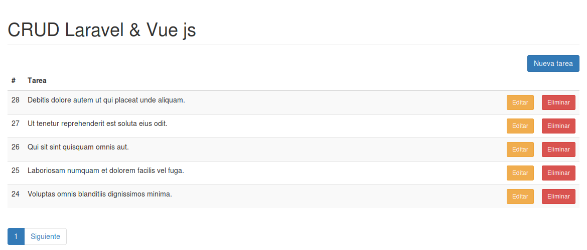

# CRUD con Laravel + Vue js + Axios
## Impartido por [@rimorsoft](https://github.com/italomoralesf) :v:

#### En esté curso aprenderas a crear un CRUD básico de tareas, con en el cual podras comprender conceptos de Vue js y Axios.

##### Te invito a que tomes el curso en el canal de [Rimorsoft](https://www.youtube.com/user/rimorsoft/playlists)

##### Sigue los siguientes pasos y podras visualizar el resultado final del curso.

##### Clona este repositorio :sunglasses:
```
git clone https://github.com/ErickZH/laravel-vuejs.git
```

##### Abre el proyecto en una terminal y realiza lo siguiente:
```php
composer install
```

###### El comando anterior instalara las dependencias necesarias para el proyecto.

##### Configuramos el archivo **.env**  que en este caso debes de crearlo en la raiz del proyecto. Debes de copiar el contenido del archivo **.env.example** al archivo creado.

##### Configuramos conexión a la base de datos.
```
DB_CONNECTION=mysql
DB_HOST=127.0.0.1
DB_PORT=3306
DB_DATABASE=laravel_vue
DB_USERNAME=root
DB_PASSWORD=******
```

##### Creamos el APP_KEY del proyecto.
```php
php artisan key:generate
```

##### Instalamos JQuery, Bootstrap, Toastr, Vue js 2 y Axios. :see_no_evil:
```
npm install
```

##### Corremos las migraciones con el siguiente comando.
```
php artisan migrate
```

##### Corremos el seed el cual genera tareas randoms.
```
php artisan db:seed
```

##### Por ultimo levantamos el servidor con el comando.
```
php artisan run serve
```

##### En tu navegador predeterminado se visualizara lo siguiente. :scream:
